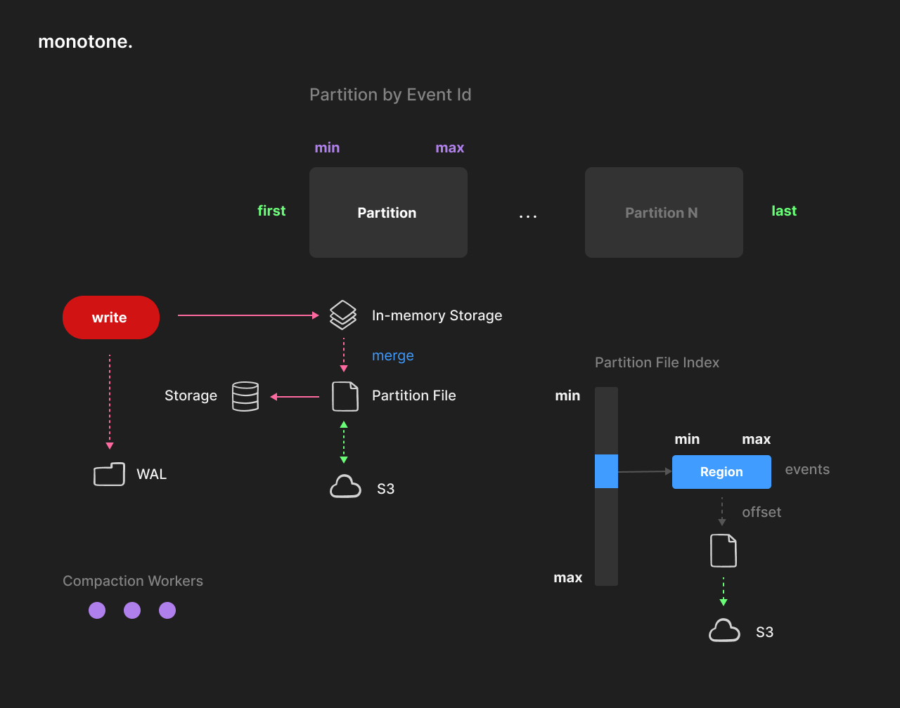

#### Architecture

Storage architecture is inspired by log-structured approach and implements custom made memory-disk hybrid engine.
Data stored in sorted partition files. Partitions never overlap. Whole database can be seen as a 64bit range sparse array of events.

Event is a pair of [u64 id, raw data]. This can be seen almost the same as in key-value approach, beside the addition of id field.
Event Id is used as a key and represents serial (or time) primary key. Additionally it is possible to specify custom comparator, which
can be used to implement compound key (use additional embedded key in your data together with id).

#### Partitioning

Each partition file contains a number of sorted regions. Regions represent a sorted list of events, variable in size and compressed (~150KiB).
Region size can affect compression efficiency and reduce number of requests required to fulfill a scan.

Each partition has ordered in-memory storage associated with partition file. Eventually in-memory storage
and partition file merged together. This is done manually or in background by a pool of workers.
Compaction is multi-threaded and scalable. Each partition file has index of regions, which contains of min/max keys of each region
and its file position. This index is kept in memory and loaded on start. Index size is insignificant even for huge data sets.

#### Refresh

Partition refresh does not block readers and writers. Partitions can be updated or readed while being refreshed at the same time without
blocking. This is implemented by switching partition to the second in-memory storage and done in a several short locking stages.
Storage designed to survive and automatically recover from crashes, which could potentially happen during
refresh (power outage).

Refresh automation is designed to reduce write-amplification as much as possible. Ideally, partition should
be written once using only memory storage as a source. Partition refresh scheduled automatically, when partition reaches its
refresh watermark (or can be done manually at any time).

In-memory storage (memtable) implemented using T-tree style data structure to reduce pointers overhead and increase data locality.
Each partition is using custom made memory allocator context optimized for sequential write and atomic free of large memory regions. 
This solves problem of memory fragmentation of malloc, greately improves data locality and allows multi-threaded compaction to work
without affecting other threads. Futhermore, the allocator optimized for using Linux Huge Pages by design (but not mandatory).

#### Read

Range scans optimized for reduced IO and the idea that it can work on top of cloud. Unlike typical B-tree or LSM trees, Monotone storage never
does more then 1 read at time to a underlying storage device or a cloud service when using cursors. This is possible to do, because region
index is kept in memory.
Each cursor is doing merge join between partition file region and in-memory storages
(one or two in case of the parallel refresh).

#### Write

Write operations never require disk access and done in-memory (with optional use of WAL for persistency).
After successful write, data immediately available for further read without delay. Any written event can be deleted or updated in the future (same as in a typical key-value storage).
Write is done in batches and transactional (atomical). Batching is mostly necessary to increase performance when using WAL.

Write never succeded unless data is written to WAL. It is also possible to disable WAL to have higher performance. If it is not critical to lose latest updates,
which were yet not refreshed and synced with disk. Write-ahead logs are automatically deleted when data are saved to partitions.

#### Locking

Storage does not implement any kind of MVCC or Snapshot Isolation. This is done consciously to avoid problems with unavoidable
necessity for garbage collection (VACUUM). Locking is done per partition instead, which is more inline with the common usage patterns.
It is possible to read and write to different partitions without blocking each other.
Storage designed to work in multi-threaded applications.

Overall design follows ideas from Sophia and PostgreSQL (Timescale), addopted for IoT and sequential data
storage/access patterns. 
